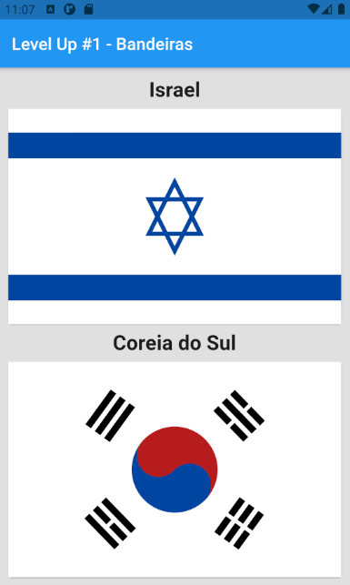
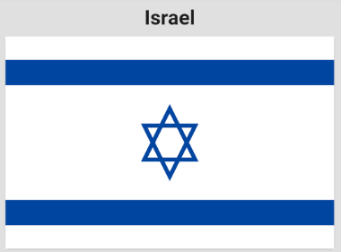
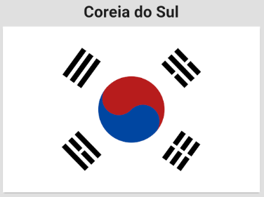
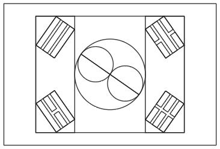

# Level Up #1

Level Up #1 - Bandeiras.

## Getting Started

Level Up são desafios propostos pela Raro Academy para consolidar o conhecimento passado durante as aulas semanais da academia. Para o Level Up #1, foi solicitado que fizessemos bandeira do Japão ou de um país de nossa escolha. Para deixar a proposta um pouco mais desafiadora, optei por fazer as baideiras de Israel e da Coreia do Sul.

### Israel

Para fazer a bandeira de Israel foram utilizados alguns conceitos ensinados durante a primeira e segunda semana da Raro Academy como: manipulação de Container, Column, Center, Row, Padding, Stack e alguns outros. O maior desafio foi criar a Estrela de Davi, contida no centro da bandeira e, para isso, precisei criar uma nova Widget chamada MyTriangle que extende da classe CustomPainter. Essa Widget é responsável por criar um triângulo e com esse triângulo eu pude criar a Estrela de Davi, pois, se você parar para observar, a estrela é formada por dois triângulos sobrepostos (Um normal e outro de cabeça para baixo).

### Coreia do Sul

A bandeira da Coreia do Sul, à primeira vista, parece assustadoramente complicada de se elaborar. Todavia não é tão complicada quanto parece ser, meu maior receio era como fazer o símbolo do Yin e Yang contido no centro da bandeira. Para uma melhor visualização de como a bandeira seria construída, eu fiz uma espécie de wireframe da bandeira e, a partir dela, consegui chegar numa solução. Da mesma maneira que a bandeira de Israel, foram utilizados Widgets como Container, Column, Center, Row, Padding, Flexible, Stack e alguns outros. Como visto no wireframe, para fazer o símbolo do Yin e Yang eu precisava de dois semicírculos formando um círculo e dentro desse círculo formado, colocar dois círculos lado a lado e cada um com diametro equivalente à metade do diametro do circulo maior.

